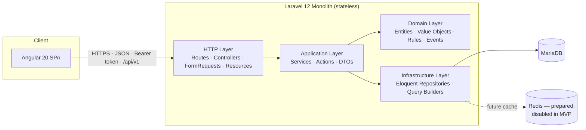
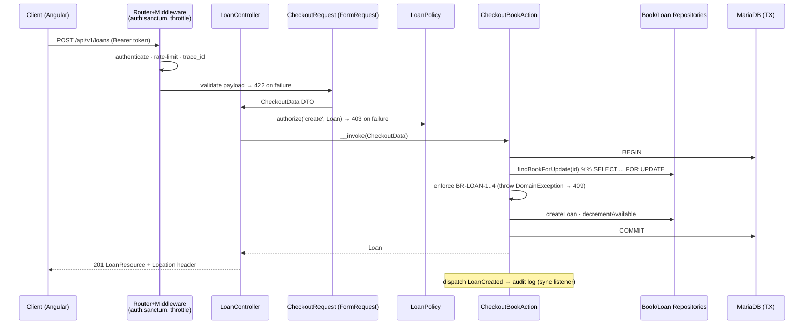

# RFC-001 — Librarium System Architecture
**Status:** Accepted • **Version:** 1.0 • **Last Updated:** 2026-07-22
**Authors:** Architecture Guild • **Reviewers:** Backend, Frontend, Security, DevOps

---

## 1. Summary

Librarium ships as a **Modular Monolith** — a single Laravel 12 deployable whose business logic is organized into isolated domain modules under `app/Library`, following **DDD-Lite** (tactical DDD patterns without full event-sourcing/CQRS ceremony). The frontend is an Angular 20 SPA with a feature-based architecture. This RFC records every significant decision with rationale, alternatives, trade-offs, and scaling path.



## 2. Architecture Style: Why a Modular Monolith + DDD-Lite

**Decision:** One deployable, strict internal module boundaries, tactical DDD patterns (entities, value objects, repositories, domain events, application services) without heavyweight strategic DDD tooling.

**Why (rationale):**
1. **Right-sized complexity.** The MVP has ~7 domains and one team. Microservices would multiply operational cost (deploys, observability, distributed transactions for `loan ↔ available_copies`) with zero user benefit. The loan/availability invariant is *trivially* safe in one ACID database and *hard* across services.
2. **Optionality preserved.** Module boundaries (each domain owns its models, services, contracts) mean any domain (e.g., Search, Loans) can later be extracted behind its existing contract interface. We buy microservice *optionality* without paying microservice *rent*.
3. **Framework decoupling as risk management.** Business rules (loan limits, availability invariants, admin protection) live in framework-free classes → testable in milliseconds, portable across Laravel majors, and readable as the domain, not as Laravel.

**Alternatives considered:**
| Alternative | Why rejected |
|---|---|
| Default Laravel MVC (fat models/controllers under `app/Http`, `app/Models`) | Business rules smear across controllers, models, and requests; no boundaries → change amplification; hard to test rules without HTTP; the codebase becomes "Laravel-shaped," not "library-shaped." |
| Microservices | Operational overkill; distributed data consistency for circulation; team of one/few. |
| Full DDD + CQRS + Event Sourcing | Ceremony without payoff at this scale; event store adds complexity the domain doesn't demand. |
| Hexagonal with full framework abstraction (no Eloquent anywhere) | Purism tax: re-implementing what Eloquent gives us. DDD-Lite keeps Eloquent at the infrastructure edge behind repository contracts — pragmatic middle ground. |

**Trade-offs accepted:** discipline is enforced by convention + static analysis (deptrac-style rules in CI), not by network boundaries; a single DB is a single point of scale (mitigated by read-replicas path, §14).

## 3. Backend Technology Choices

| Choice | Why | Alternatives / trade-offs |
|---|---|---|
| **Laravel 12 / PHP 8.4** | Mature ecosystem for exactly this app class: auth (Sanctum), validation, policies, queues, testing. PHP 8.4 property hooks/readonly classes make DTOs & VOs clean. Team fluency. | Symfony (more explicit, slower to ship), NestJS (fine, but PHP fits assessment context). Trade-off: framework gravity — countered by the Library layer. |
| **MariaDB** | ACID relational fit for a ledger-like domain (loans, availability); mature FULLTEXT + generated columns; ubiquitous ops knowledge. | PostgreSQL nearly equal (would also be fine); MongoDB rejected — relational integrity is the core requirement. |
| **Sanctum** | First-party, lightweight token auth for SPA/API; no OAuth server complexity. | Passport (OAuth2) overkill for first-party client; JWT libs add key-rotation burden without benefit here. |
| **Redis (prepared, not enabled)** | Cache/queue-ready via config switch; MVP uses `database` queue + no cache to keep infra minimal. | Enabling Redis day-1 adds an infra dependency before any measured need. |
| **Swagger/OpenAPI 3.1** (generated via attributes) | Contract-first collaboration with frontend; committed spec = CI diff on breaking changes. | Hand-written spec drifts; attributes keep spec adjacent to code. |
| **Laravel Pint + PHPStan lvl 8 + Pest** | Style, static safety, expressive tests as CI gates. | — |

## 4. Folder Structure & Layer Responsibilities

```text
app/
├── Http/                      # Thin framework edge only (Controllers, Middleware)
└── Library/                   # ← ALL business logic lives here
    ├── Shared/                # Cross-domain building blocks
    │   ├── Domain/            #   base ValueObject, DomainException, DomainEvent, Result
    │   ├── Application/       #   Pagination DTOs, Sorting/Filter value objects, Clock contract
    │   └── Infrastructure/    #   BaseEloquentRepository, TransactionRunner, AuditLogger
    ├── Application/           # Cross-domain use-cases (Dashboard aggregation, Search façade)
    ├── Domains/
    │   ├── Books/
    │   │   ├── Models/        # Eloquent models (persistence shape)
    │   │   ├── Services/      # Application services (use-case orchestration)
    │   │   ├── Actions/       # Single-purpose invokable use-cases (CreateBook, DeleteBook)
    │   │   ├── Repositories/  # Eloquent implementations of Contracts
    │   │   ├── Contracts/     # Interfaces (BookRepositoryInterface) — dependency inversion seam
    │   │   ├── DTOs/          # Immutable input/output data (BookData, BookFilters)
    │   │   ├── ValueObjects/  # Isbn, CopyCount — validated-at-construction types
    │   │   ├── Enums/         # e.g., BookSortField
    │   │   ├── Policies/      # Authorization rules for the domain
    │   │   ├── Events/        # BookCreated, BookDeleted (domain events)
    │   │   ├── Requests/      # FormRequests (validation rules for this domain's endpoints)
    │   │   ├── Resources/     # API Resources (response shaping)
    │   │   └── Exceptions/    # BookHasActiveLoansException, etc. → mapped to HTTP codes
    │   ├── Authors/  Categories/  Users/  Loans/  Dashboard/  Auth/   # same internal shape
    └── Infrastructure/        # App-wide adapters (mail, external APIs — future)
```

**Responsibilities, layer by layer:**
- **Requests (FormRequests):** input shape & syntactic validation only. Produce **DTOs** — controllers never pass raw arrays inward.
- **Controllers (app/Http):** ≤ ~10 lines each: authorize (Policy) → build DTO from Request → call Action/Service → return Resource. Zero business logic.
- **Actions:** one use-case, one class, one `__invoke` (`CheckoutBookAction`). They orchestrate: load via repository contracts, enforce domain rules (or delegate to domain services/VOs), run in transactions, dispatch events. Actions are the unit of business testing.
- **Services:** shared orchestration used by multiple actions (e.g., `AvailabilityService`).
- **DTOs:** immutable `readonly` classes crossing layer boundaries; decouple HTTP shape from domain shape.
- **Value Objects:** make illegal states unrepresentable — `Isbn::fromString()` normalizes + checksums or throws; `DueDate` enforces the 1–60-day window.
- **Repositories + Contracts:** persistence behind interfaces; domain depends on `*Interface`, container binds Eloquent impls. Enables in-memory fakes for fast tests and future storage swaps.
- **Policies:** authorization per domain; registered centrally; the only place role logic lives.
- **Events:** decouple side-effects (audit logging, future cache invalidation, future notifications) from use-cases.
- **Resources:** response contracts; version-stable JSON; conditional fields by role.
- **Exceptions:** domain exceptions carry stable `code`s; a single exception handler maps them to the error envelope (§10).

**Why superior to default Laravel layout:** default layout organizes by *technical type* (all models together, all requests together), so one feature change touches five distant folders and rules have no home. Domain-first layout gives **high cohesion** (everything about Loans is in `Domains/Loans`), **screaming architecture** (the tree says "library system," not "Laravel app"), **enforceable boundaries** (CI forbids `Domains\Books` → `Domains\Loans` internals; cross-domain via Contracts/Events only), and **team scalability** (domain ownership, minimal merge conflicts).

## 5. Dependency Flow & Request Lifecycle

**Dependency rule:** source dependencies point inward. `Http → Application (Actions/Services) → Domain (VOs/Rules/Contracts)`; `Infrastructure` implements Domain contracts and is wired by the container. Domain code imports no Laravel facades (Clock, TransactionRunner, and logging are injected contracts).



## 6. Pattern Deep-Dives

- **Repository Pattern — why here:** not dogma; three concrete payoffs: (1) unit tests of Actions with in-memory fakes (no DB → millisecond suites for rule logic), (2) a seam for future storage changes (read replicas, search engine for queries), (3) query logic centralization (no scattered `where` chains). Kept honest: repositories return domain-meaningful methods (`findActiveLoansForUser`), never leak query builders outward.
- **DTO usage:** every boundary crossing is a typed immutable object (`readonly` promoted-property classes). Benefits: refactoring safety (rename a field = compiler-visible), self-documenting signatures, no "mystery array keys". `FromRequest` factory methods live on DTOs, keeping FormRequests thin.
- **API Resources:** single place per entity defining public JSON; conditional inclusion (`when($user->isStaff(), ...)`) implements role-scoped fields; guarantees DB column renames never leak into the contract.
- **Policies / Authorization flow:** middleware authenticates; controller's first statement authorizes via Policy; Policies read only `role` (+ ownership where relevant: members may view their own loans). One matrix (PRD §8.3), one implementation locus, tested per role per ability.
- **Validation flow:** syntax in FormRequests (types, formats, existence) → semantics in Domain (business rules). Rationale: `422` = "your input is malformed"; `409` = "your input is fine, the world disagrees". Clean split keeps rules testable without HTTP.
- **Authentication flow:** Sanctum tokens; login issues token (+ ability claims unused in MVP); middleware `auth:sanctum` resolves user; deactivation/logout revoke tokens (DB-backed → immediate).

## 7. Error & Exception Handling

Single envelope (PRD FR-ERR): `{"error":{"code","message","details","trace_id"}}`.

Mapping in one exception handler:
| Exception | HTTP | Code example |
|---|---|---|
| `ValidationException` | 422 | `VALIDATION_FAILED` + per-field `details.errors` |
| `DomainException` subclasses | 409 (or per-exception) | `LOAN_LIMIT_REACHED`, `BOOK_HAS_ACTIVE_LOANS`, `LAST_ADMIN_PROTECTED` |
| `AuthenticationException` | 401 | `UNAUTHENTICATED` |
| `AuthorizationException` | 403 | `FORBIDDEN` |
| `ModelNotFoundException` | 404 | `NOT_FOUND` |
| `ThrottleRequestsException` | 429 | `RATE_LIMITED` |
| anything else | 500 | `INTERNAL_ERROR` (generic message; full context logged with `trace_id`) |

Domain exceptions are part of the domain's public API — each carries its stable code and safe message; the handler never leaks stack traces or SQL in production.

## 8. Logging & Observability Strategy

- **Structured JSON** (Monolog formatter) to stdout → aggregator-agnostic.
- **Correlation:** middleware assigns/propagates `trace_id` (honors inbound `X-Request-Id`); included in every log line and every error envelope → one grep from user report to full trace.
- **Request log:** method, route, user_id, status, duration_ms.
- **Audit trail via domain events:** `LoanCreated/Returned`, `UserRoleChanged`, `*Deleted` → sync listener writes `info` audit entries (who/what/when). This is the seed of a future `audit_logs` table.
- **Levels:** `debug` local only; `info` business events; `warning` domain-rule rejections (aggregatable signal); `error` unhandled.
- Health: `GET /up` (framework), DB connectivity check for deep health.

## 9. Database Strategy (MariaDB)

### 9.1 Model
```mermaid
erDiagram
    USERS ||--o{ LOANS : borrows
    BOOKS ||--o{ LOANS : "is loaned in"
    BOOKS }o--o{ AUTHORS : "author_book"
    BOOKS }o--o{ CATEGORIES : "book_category"

    USERS { bigint id PK; string name; string email UK; string password; enum role "admin|librarian|member"; bool is_active; datetime deleted_at "soft"; timestamps t }
    BOOKS { bigint id PK; string title; string isbn UK "normalized"; text description; string publisher; smallint publication_year; string cover_url; smallint total_copies; smallint available_copies "CHECK 0..total"; datetime deleted_at "soft"; timestamps t }
    AUTHORS { bigint id PK; string name; text bio; smallint birth_year; timestamps t }
    CATEGORIES { bigint id PK; string name UK; string slug UK; string description; timestamps t }
    LOANS { bigint id PK; bigint user_id FK; bigint book_id FK; date loaned_at; date due_date; datetime returned_at "null=open"; timestamps t }
```
Normalized to 3NF; the deliberate denormalization is `books.available_copies` — a maintained counter (vs. computing `total − open loans` per row) so catalog lists never join/aggregate loans. Integrity is protected by: transactional updates only, `CHECK (available_copies BETWEEN 0 AND total_copies)`, and a nightly reconciliation job comparing counter vs. open-loan counts (drift alarms).

### 9.2 Indexing strategy
| Table | Index | Serves |
|---|---|---|
| books | UNIQUE(isbn) | ISBN lookup/scan; dedupe |
| books | (title) BTREE + FULLTEXT(title, description, publisher) | prefix search; relevance search |
| books | (publication_year), (available_copies) | filters |
| loans | (user_id, returned_at) | "member's active loans" (rule checks, My Loans) |
| loans | (book_id, returned_at) | "book's active loans" (delete guard, availability audit) |
| loans | (due_date, returned_at) | overdue scans/report |
| authors | (name) | autocomplete |
| categories | UNIQUE(name), UNIQUE(slug) | integrity + lookup |
| pivots | PK(book_id, author_id) + reverse index | both join directions |
| users | UNIQUE(email), (role, is_active) | auth; admin filters |

Principles: index for the query log, not speculatively; composite indexes ordered by selectivity/usage; verify with `EXPLAIN` on seeded 10k/50k data in CI perf tests.

### 9.3 Concurrency & transactions
Check-out uses `SELECT ... FOR UPDATE` on the book row inside the transaction (or equivalently a conditional `UPDATE ... SET available = available − 1 WHERE available > 0` asserting affected-rows = 1). Chosen: row lock — it also serializes the rule checks (limit, overdue, duplicate) against concurrent loans for the same member/book. Lock scope is one row, held for milliseconds → negligible contention at library scale.

## 10. Performance Strategy

- **Pagination everywhere:** page-based (`LIMIT/OFFSET`), capped `per_page=100`. Offset pagination is O(offset) at extreme depths — acceptable at MVP scale; cursor pagination is the documented v2 path for `loans` history if needed.
- **N+1 prevention:** `Model::preventLazyLoading()` outside production; repositories declare eager loads explicitly (`with(['authors','categories'])`); feature tests assert query counts (`expectsDatabaseQueryCount`-style) on hot endpoints.
- **Eager loading strategy:** list endpoints load only list-needed relations; counts via `withCount` (SQL subquery) instead of loading collections; dashboard uses single-pass aggregate queries (GROUP BY), never per-row loops.
- **Query optimization:** covering indexes for hot filters; `EXPLAIN` review checklist in PR template for new queries; avoid `SELECT *` in reporting queries.
- **Caching (prepared):** key convention `librarium:v1:<domain>:<key>`; invalidation wired to domain events (`BookUpdated` → forget book keys). MVP enables only HTTP validators (ETag) on book detail. Redis flip = config change, zero code change — the seam exists, the dependency doesn't.

## 11. Search Strategy

MVP: **database-native search behind a `BookSearchInterface` contract.**
- ISBN-shaped queries (after normalization) → exact unique-index lookup (fast path, scanner-friendly).
- Text queries → MariaDB FULLTEXT (natural language mode) across title/description/publisher, UNION'd with indexed `name LIKE 'q%'` prefix matches on authors/categories via joins; relevance score orders results; all standard filters compose on top.
- Why not Meilisearch/OpenSearch now: another service to run, sync pipeline to maintain, and library-scale data (≤ ~100k titles) is comfortably in FULLTEXT territory. The contract seam means Laravel Scout + Meilisearch is a drop-in future implementation (typo tolerance, faceting) with zero controller changes — documented as the trigger point: >250k titles or user complaints about typo handling.

## 12. Security

- **AuthN:** Sanctum bearer tokens; hashed at rest; revocation on logout/deactivation/password change. Passwords argon2id.
- **AuthZ:** deny-by-default; every route behind `auth:sanctum` except login/register; Policies on all actions; object-level checks (members ↔ own loans) prevent BOLA/IDOR — the #1 API risk.
- **Input:** FormRequest validation on 100% of writes; Eloquent parameterization (no raw SQL with interpolation); mass-assignment protection via DTO whitelisting (fillable irrelevant since we never `fill($request->all())`).
- **Rate limiting:** login/register 5/min per IP+email; authenticated API 60/min per user; 429 + `Retry-After`.
- **Transport & headers:** HTTPS-only (HSTS), `X-Content-Type-Options: nosniff`, `X-Frame-Options: DENY`, strict CORS allow-list (SPA origin only).
- **OWASP API Top 10 mapping:** BOLA → policies+ownership tests; Broken AuthN → Sanctum+rate limits+revocation; Excessive Data Exposure → API Resources only, role-conditional fields; Lack of Rate Limiting → throttles; BFLA → policy matrix tests per role; Mass Assignment → DTOs; Security Misconfig → debug off, headers, env secrets; Injection → ORM parameterization; Improper Inventory → OpenAPI committed; Insufficient Logging → §8 audit events.
- **Secrets:** env-only; no secrets in repo; token strings never logged.

## 13. Testing Strategy

| Layer | Tooling | What |
|---|---|---|
| Unit (fast) | Pest, no DB | Value Objects (ISBN checksum table-driven), Actions with in-memory repository fakes covering every BR-* rule |
| Feature/API | Pest + RefreshDatabase | Every endpoint × role matrix (200/201/401/403/404/409/422), envelope shape, pagination/sort/filter contracts |
| Concurrency | Feature | Parallel checkout of last copy → exactly one success |
| Performance guard | Feature | Query-count assertions on hot endpoints; seeded p95 smoke |
| Static | PHPStan lvl 8, Pint, deptrac boundaries | CI-blocking |
| Contract | OpenAPI diff | Breaking-change detection on the committed spec |

Coverage gate: 80% on `app/Library`. Test data via factories + a realistic demo seeder (also powers reviewer demo).

## 14. Scalability Strategy (path, in order of need)

1. Stateless app → add instances behind LB (nothing to change; tokens in DB).
2. Enable Redis cache on read-hot endpoints (dashboard, book lists) via existing seam.
3. MariaDB read replicas; route reporting/dashboard reads to replicas (Laravel read/write connections).
4. Move queue to Redis; async-ify side effects (audit, future notifications).
5. Extract Search to Meilisearch behind existing contract.
6. Only then, if organizationally warranted: extract a domain (e.g., Loans) — boundaries and contracts already exist.

## 15. Frontend Architecture (Angular 20)

### 15.1 Folder structure
```text
src/
├── core/            # singletons: auth store, interceptors, guards, api client, config
├── shared/          # ui/ (dumb components) · directives/ · pipes/ · models/ (API types) · utils/
├── features/        # books/ authors/ categories/ loans/ users/ dashboard/ auth/ search/
│   └── books/       #   pages/ (smart) · components/ (dumb) · data/ (store + api service) · books.routes.ts
├── styles/          # tokens.scss · theme.scss · base.scss
└── storybook/       # docs pages, decorators, mock providers
```
- **core/**: provided-in-root singletons; imported once; no feature imports core *pages*, only services.
- **shared/**: stateless, reusable, story-covered; may not import features.
- **features/**: vertical slices — everything a feature needs, lazy-loaded via its `*.routes.ts`. Features never import each other directly (cross-feature via shared models or core services).

**Why feature-based (vs. type-based `components|services|pipes` folders):** cohesion (a change to Loans touches one folder), natural lazy-loading boundaries (folder = bundle), team ownership, and deletability — removing a feature is `rm -rf` plus a route line. Mirrors the backend's domain modularity: the two trees speak the same domain language.

### 15.2 Building blocks (why each)
- **Standalone components:** no NgModules → less indirection, per-component imports make dependencies explicit, better tree-shaking; Angular's default direction.
- **Signals:** synchronous, glitch-free reactive state with fine-grained change detection (zoneless-ready); `computed` derives (e.g., `overdueCount`), `effect` syncs filters↔URL. Chosen over NgRx: app-local state is modest; signal stores give 90% of the value at 10% of the boilerplate. Documented trigger to revisit: shared cross-feature mutation flows.
- **RxJS:** where time matters — debounced search, `switchMap`-cancelled type-aheads, router streams, HTTP. Boundary rule: convert to signals via `toSignal` at the store; templates read signals only.
- **Services:** `*ApiService` per feature (typed HTTP, maps envelopes/DTOs), `*Store` per feature (signals + methods), core `AuthStore`/`ToastService`/`ConfirmService`.
- **Guards:** functional `authGuard`, `roleGuard(roles)`, `pendingChangesGuard` — thin, composable, testable.
- **Interceptors:** functional `authToken`, `apiError` (401→relogin, 403→forbidden, 5xx→toast+trace_id), optional `loading`.
- **Route organization:** root routes lazy-load feature route arrays; layout routes wrap children; data resolvers only where a page is useless without data (book detail); titles via route `title` for a11y.
- **Angular Material:** WCAG-tested primitives (tables, dialogs, forms, snackbar) themed by M3 tokens → we invest design effort in domain components, not rebuilding dropdowns.
- **SCSS tokens:** single source for color/space/type; enables dark mode by token swap.
- **Storybook:** contract + catalog (organization per Frontend PRD §8.5); interaction + a11y tests run in CI.

### 15.3 Component communication
Parent→child `input()` signals; child→parent `output()`; sibling/cross-page via feature stores; global (auth, theme, toasts) via core singletons. No event-bus services; no deep `@ViewChild` coupling.

## 16. Decision Log (summary)

| # | Decision | Status |
|---|---|---|
| ADR-1 | Modular monolith over microservices | Accepted |
| ADR-2 | DDD-Lite under `app/Library`, framework-thin edges | Accepted |
| ADR-3 | Single-column role enum (3 roles) over permission tables | Accepted (revisit at custom-roles demand) |
| ADR-4 | Maintained `available_copies` counter + reconciliation | Accepted |
| ADR-5 | Row-lock transactional checkout | Accepted |
| ADR-6 | DB-native search behind contract; Meilisearch later | Accepted |
| ADR-7 | Redis prepared, disabled in MVP | Accepted |
| ADR-8 | URI versioning `/api/v1` | Accepted |
| ADR-9 | Angular signals-first, no NgRx | Accepted |
| ADR-10 | Page-based pagination, cursor later where needed | Accepted |

---
*End of Architecture RFC.*
